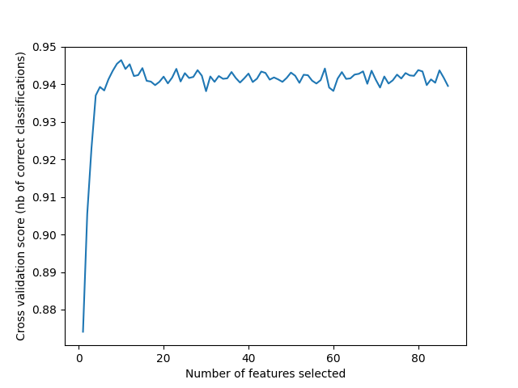
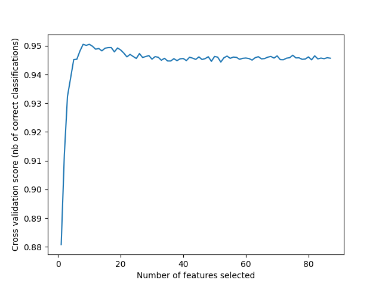

# COVID-19

This study aims the development of a support vector regression model for the prediction of SARS-CoV-2 main protease inhibitors.
The regression problem is a generalization of the classification problem, in which the model returns a continuous-valued output.

## Dataset
A set of about 700 compounds having inhibitor activity against the SARS-CoV-2 main protease were collected from https://covid.postera.ai/covid/activity_data. For each molecule were reported the IC50 values that lead to the identification of the most (and less) potent compounds.  
1D and 2D molecualar descriptos were calulated with PaDEL software in order to build up the SVR model.
The dataset is composed by covalent and non covalent inhibitors. Since the dataset contains molecules derived from fragments having covalent warheads, some molecules could covalently inhibit Mpro if the warheads are mainteined in the structures. However, the inhibition mode is not indicated. In order to detect covalent-noncovalent compounds, I wrote and ran the cov_filter.py script which uses SMARTS patterns to detect cystein-protese (as is Mpro) covalent warheads. However, by checking the 2D structures the dataset remains composed of covalent and non covalent inhibitors.

## Training and Test sets
The training and test sets were generated by random division. The dataset was split into 80% train and 20% test.
Missing values were imputed with the mean value of the column, columns containg identical values were deleted and high correlated descriptor were deleted.

Results:
After the cleaning steps 1063 out of 1150 columns (molecular descriptors) were deleted.
87 Molecular descriptors were preserved.

## Feauture Selection
Random Forest regressor (RF) approach was applied to the dataset to figure out a set of chemical descriptors related to bioactivity proprieties (IC50) from 1150 molecular descriptors calculated. Moreover a recursive feauture elimination and cross-validated selection were performed over the RF in order to detect the most important descriptors --> You'll wrap a Recursive Feature Eliminator around a random forest model to remove features step by step. 
The outcome of Recursive feauture elimination with cross-validation leaded also to the automatic touning of the number of MD to be selected and to set the optimal number of RF decisional trees. 
Here are reported the plot of the relation between the Cross-validated score and the number of feauture selected when the number of decisional trees was set as 10 and 100. As can be seen, when n_trees=100, I get a higher cross validation score (>0.95). So, the number of trees was set as 100. If I increase the number of trees I would't get significant performance, it would only increase the computational cost (DOI: 10.1007/978-3-642-31537-4_13).

10 trees              |  100 trees
:-------------------------:|:-------------------------:
  |  

Results:
The number of Molecular Descriptors selected was 10, and they are:
* apol -> Electronic Descriptor
* nF -> Atom count
* ATS0m -> Autocorrelation
* VR1_Dzv -> Barysz matrix
* VR1_Dze -> Barysz matrix
* ASP-0 -> Chi path
* VR1_Dt -> Detour matrix
* mindO -> Atom type electrotopological state
* ETA_Shape_Y -> Atom type electrotopological state

## SVR
The training was performed with the training set.
For the SVR model, it was necessary to select the optimal for the Kernel function, C, gamma and epsilon hyperparameters. In order to select the optimal parameters an algorithm Grid was used.

Results:
best parameters  {'C': 100.0, 'epsilon': 1.0, 'gamma': 0.01, 'kernel': 'rbf'}

## Evaluation
The SVR model was evaluated using the test set. R square, MSE (mean square error), MAE(mean absolute error) and RMSE (root mean squared error) metric was calculated.

Results:
* Mean Absolute Error: 4.083445516968702
* Mean Squared Error: 39.48697080111405
* Root Mean Squared Error: 6.283865912088994
* R square:  0.9646013936795563

